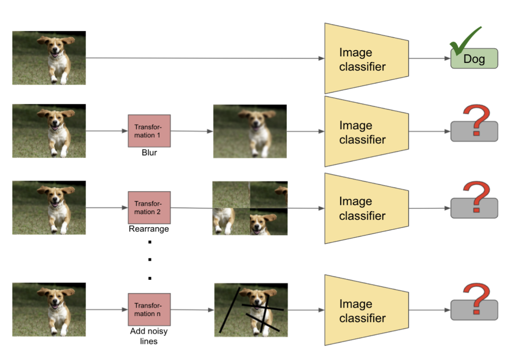

# An Investigation on Performance Degradation of Image Classifiers Using Image Transformations

## CS 6220 Group Project

Authors:
- [Harsh Maheshwari](http://harshm121.github.io/)
- Meghna Bhatnagar
- Nathan Knauf
- Sambhav Mattoo

### Motivation and Approach

### Presentations:
- Proposal presentation available [here](https://docs.google.com/presentation/d/1Vo-HQtcFcbZXOcGleHs86rCro4IbmEJV2XwvBnUDsQ8/edit?usp=sharing)
- Workshop presentation available [here](https://docs.google.com/presentation/d/122RrrYw-hVRmr8YUb4xW4Bz0ypH7807KPcY9iAIXBKM/edit?usp=sharing)
